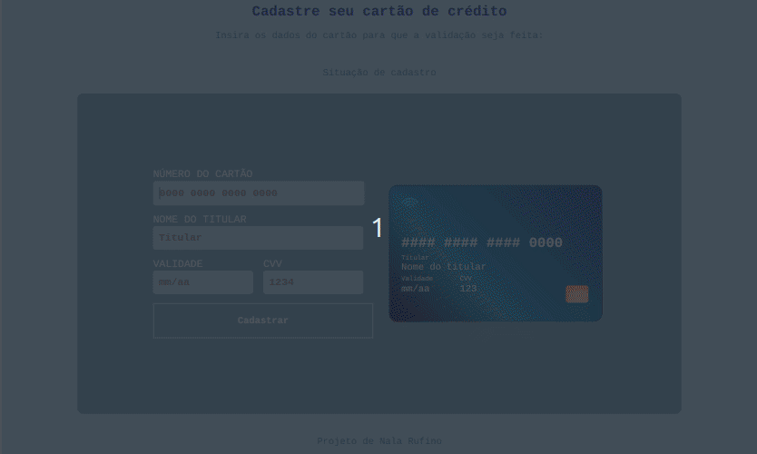
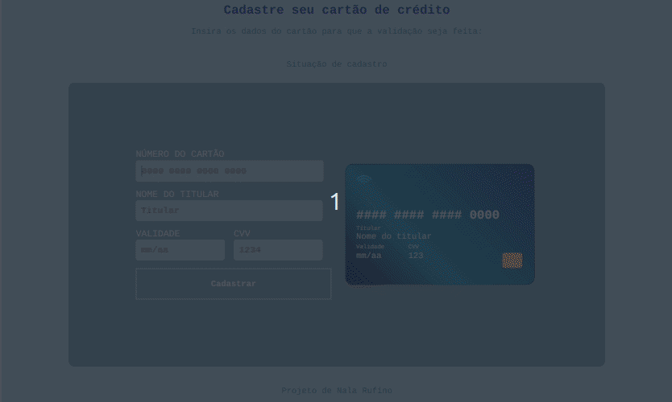
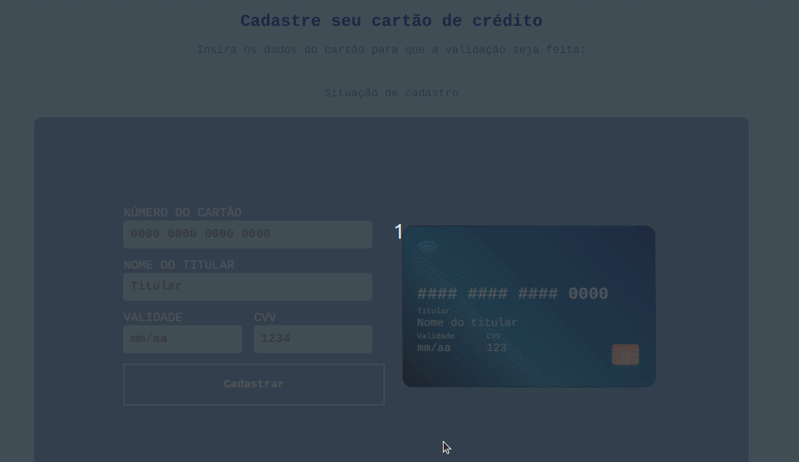

# Carteira digital - Validação de cartão

## Índice

* [1. Introdução ao projeto](#1-introdução)
* [2. Funcionamento](#2-funcionamento)
* [3. Detalhes do projeto](#3-detalhes-do-projeto)
* [4. Métodos](#4-métodos)
* [5. Interface](#5-interface)

***

## 1. Introdução ao projeto

Neste projeto, pensei em um aplicativo da Web que permita ao usuário validar o número de um cartão de crédito para cadastra-lo em uma carteira digital. Podendo facilitar os pagamentos por aproximação e, assim, evitando o contato direto do usuário com o cartão e maquininha.

## 2. Funcionamento

Utilizando o algoritmo de Luhn este projeto busca validar números de cartões de crédito para cadastrar nesta carteira digital.

Esse algoritmo funciona da seguinte maneira: Obtemos o inverso do número a ser verificado (que contém apenas dígitos [0-9]); todos os dígitos que ocupam uma posição par devem ser multiplicados por dois; se o resultado da multiplicação for maior ou igual a 10 devemos somar os dígitos deste decimal ou subtrair por 9; o número a verificar será válido se a soma de seus dígitos finais for um múltiplo de 10, onde o resto deverá ser 0.

## 3. Detalhes do projeto

-> Uma interface que permite ao usuário:

Inserir o número que deseja validar usando apenas caracteres numéricos (dígitos) no input "NÚMERO DO CARTÃO" para validar - também é possível inserir o nome do titular, a validade do cartão e o cvv, estes porém não serão levados em conta para a validação do cartão - e, com o click no botão "Cadastrar" retorna:

1 - se o número for válido, aparecerá a mensagem de cadastro realizado com o número mascarado (apenas os quatro últimos dígitos à mostra)

2 - se o número for inválido, aparecerá a mensagem: "Número de cartão inválido, tente novamente!"

3 - caso sejam apresentados números menores que 11 ou sequências de 0, aparecerá um alerta com a mensagem: "Por favor, digite números válidos"

## 4. Métodos

Os métodos validator (isValid e maskify) são cobertos por testes unitários.
isValid consiste em conferir o algoritmo de Luhn e o maskify é o algoritmo que mascara os números do cartão mostrando apenas os quatro últimos.

## 5. Funcionamento

-> Possíveis casos

° Número de cartão válido

° Número de cartão inválido

° Números inválidos

